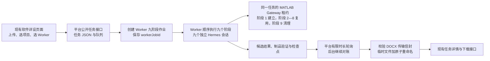

# 软件详设九阶段流水线架构与交接

- 文档状态：第一版可运行功能的架构基线
- 代码基线：`40ce4d236813201ad4776e1c3b2beec08d0f6f1e`
- 阶段目录版本：`software-detail-minimal/v1`
- 作业协议版本：`software-detail-minimal-job/v1`

## 目标、范围与当前结论

本轮改造的第一优先级是证明下面这条功能链能够真实运行：

> 一个整体 Hermes 任务，拆成九个独立小任务；每个小任务调用一个职责明确的技能；九个阶段依次产出受控中间制品，最终生成可下载的 Microsoft Word 文档（DOCX）。

九个阶段的划分是工程调度边界，不是对原技能 21 项工作步骤的逐项机械映射。原技能中的业务要求、生成约束、参考资料、脚本和模板必须完整保留；允许改变的是任务如何分段、阶段之间如何传递制品，以及平台端（Platform）、执行端（Worker）和 MATLAB Gateway 如何调度这些阶段。

当前代码已经具备九阶段目录、九个同名技能、Worker 作业服务、任务级 MATLAB 租约、平台任务接线、阶段展示和最终 DOCX 传输。自动化测试和合成夹具可以验证这些部件的合同与串联关系，但截至本文档基线，还没有使用真实 Hermes 推理、真实 MATLAB/Simulink、真实业务模型和 Mac 容器组合完成一次同类输入的前端全流程。因此，当前状态不能表述为“真实业务流程已经跑通”。

本文后续使用以下技术名称：JavaScript 对象表示法（JSON）用于阶段清单和结果文件，超文本传输协议（HTTP）用于平台与 Worker 通信，Base64 用于把 DOCX 字节放入文本响应，256 位安全哈希算法（SHA-256）用于核对文件内容。英文组件名 Platform、Worker 和 Gateway 首次出现时均与其中文职责一起说明，不代表新增产品入口。

## 权威业务来源与拆分不变量

软件详设业务内容的唯一权威来源固定为：

| 项目 | 固定值 |
| --- | --- |
| 权威分支 | `origin/release/windows-prod` |
| 权威提交 | `ce5d3c2c08788fa8ab9013f18bd985f7355df0b6` |
| 原技能目录 | `skills/hermes/simulink-module-description-generator` |
| 原 `SKILL.md` Git blob | `8e99cda6da9b54153b73476f884b463ebe8b1bc4` |
| 原 `SKILL.md` 内容 SHA-256 哈希 | `f9b9fb108ad5bee97597f9dc01a59cf37a6f85f0afd619b21b78df291f8d1dae` |
| 权威目录文件数 | 13：`SKILL.md` 加 12 个资源文件 |

`docs/software-detail-skill-stage-map.json` 是机器可读的完整映射清单，`docs/software-detail-skill-stage-map-adr.md` 记录拆分决策。映射保留原 `SKILL.md` 的 24 条默认行为、21 项工作流程和 13 条输出规则，共 58 条；其中 10 条是九阶段共同消费的共享规则。五份参考资料、五个脚本、原始 DOCX 模板和技能发现元数据均登记了固定 blob、内容哈希、负责阶段和使用阶段。

九个新技能及其共享运行资料遵守以下不变量：

1. 九个阶段的规则并集必须覆盖原技能全部 58 条规则，不能增加会改变详设业务含义的生成逻辑。
2. 九个阶段共同读取字节一致的 `software-detail-shared-rules.json`。
3. 原参考资料、脚本和 DOCX 模板从固定业务源进入 `software-detail-runtime`，不得在阶段技能中另造一套业务标准。
4. 原技能的 21 项工作步骤可以跨相邻阶段连续执行，也可以在一个阶段内合并执行；原步骤数量不决定阶段数量。
5. 目标是让九阶段受到的业务指导和约束与原整体技能一致。由于 Hermes 推理本身可能存在非确定性，这一不变量约束的是输入依据、业务规则和输出门槛，不承诺两次生成的每个字都完全相同。

## 总体数据流



前端仍使用 `/software-detail-design-generation`。用户继续上传一个 `.slx` 模型、一个 `.mat` 数据文件和可选的 `.m` 初始化脚本，选择项目与 Worker，然后查看任务、阶段状态并下载结果。旧 `/detail-design-generation`、`detail_design` 和 `generator.js` 不属于这条链路。

## 九阶段合同

所有阶段都必须启动一个新的 Hermes Agent 会话，并显式调用与阶段标识相同的技能。表中的“宿主处理”指 Worker 的确定性编排；业务分析和文案生成仍由阶段技能指导 Hermes 完成。

| 顺序 | 阶段标识 / 技能 | Hermes Agent 的业务职责 | Worker 宿主与 MATLAB 处理 | 确定输入角色 | 确定输出角色 |
| ---: | --- | --- | --- | --- | --- |
| 100 | `software-detail-stage-01-initialize` | 定位任务输入；使用任务工作区内的项目 addon 与初始化脚本；在已建立的租约中初始化 MATLAB 支持并加载模型 | 校验输入文件和项目/Worker 选择；确认任务工作区并创建阶段目录、Gateway workspace 和任务专属租约；宿主写入租约制品 | `source-model`、`model-data`、可选 `model-init-script`、`project-selection`、`worker-selection` | `input-manifest`、`workspace-manifest`、`matlab-session-lease` |
| 200 | `software-detail-stage-02-model-plan` | 轻量扫描模型，确定文档单元、分析单元、父子关系、直接输入输出允许清单和有界分析队列 | 取得并核对阶段 1 的租约；不新建 MATLAB 会话；绑定并检查上游制品 | `input-manifest`、`workspace-manifest`、`matlab-session-lease` | `model-index`、`hierarchy-manifest`、`analysis-queue` |
| 300 | `software-detail-stage-03-evidence-extract` | 按分析单元深读端口、结构、参数、查表、延迟、状态和输出附近逻辑，生成证据分片 | 复用同一租约向原生 MATLAB Gateway 发起受租约约束的读取；逐个验证输出文件 | `input-manifest`、`workspace-manifest`、`matlab-session-lease`、`model-index`、`hierarchy-manifest`、`analysis-queue` | `evidence-shards` |
| 400 | `software-detail-stage-04-output-ledger` | 按文档单元聚合证据，从直接输出反向追踪，形成私有的输出优先台账和覆盖报告 | 绑定已验证的分析队列与证据分片；复用租约；检查候选结果和输出文件 | `matlab-session-lease`、`analysis-queue`、`evidence-shards` | `output-ledger`、`coverage-report` |
| 500 | `software-detail-stage-05-boundary-projection` | 将内部证据投影为当前文档单元的直接边界行为，形成行为分组和叙事压缩计划 | 绑定台账、覆盖报告和证据分片；复用租约；验证制品边界 | `matlab-session-lease`、`evidence-shards`、`output-ledger`、`coverage-report` | `boundary-projection`、`behavior-groups`、`narrative-plan` |
| 600 | `software-detail-stage-06-architecture-draft` | 根据模型事实编写模型用途、总体结构、架构和接口草稿 | 绑定已验证的台账、边界投影和叙事计划；复用租约 | `matlab-session-lease`、`output-ledger`、`boundary-projection`、`narrative-plan` | `architecture-draft` |
| 700 | `software-detail-stage-07-module-draft` | 按文档单元和行为分组编写“功能描述”和“实现方式”；“设计依据”正文默认留空 | 绑定架构草稿和阶段 4、5 制品；复用租约 | `matlab-session-lease`、`output-ledger`、`boundary-projection`、`behavior-groups`、`narrative-plan`、`architecture-draft` | `module-draft` |
| 800 | `software-detail-stage-08-content-check` | 检查并修正层级、边界、行为密度、输出覆盖、内部标识符、可追溯性和写作问题 | 绑定两类草稿、台账与覆盖报告；复用租约；只在候选结果和制品通过后推进 | `matlab-session-lease`、`output-ledger`、`coverage-report`、`architecture-draft`、`module-draft` | `checked-content`、`content-check-report` |
| 900 | `software-detail-stage-09-docx-finalize` | 使用原模板生成 DOCX，形成原生 Word 列表，复验最终文本和边界，并清理本任务打开的模型与路径 | 先验证 DOCX、制品清单和候选结果，再关闭并确认任务租约；写入最终检查点 | `workspace-manifest`、`matlab-session-lease`、`content-check-report`、`checked-content` | `detail-design-docx`、`artifact-manifest` |

### Agent 产出与宿主确定性处理的边界

Hermes Agent 负责读取当前阶段技能和上游制品，完成模型分析、证据整理、内容生成、内容检查或 DOCX 生成，并把唯一候选结果写到宿主指定路径。Agent 的标准输出只用于诊断，不能作为阶段成功依据。

Worker 宿主负责：

- 按目录合同绑定本阶段输入和输出路径；
- 在任务开始时安装并发现九个技能与共享运行资料，记录本次作业使用的技能版本和内容哈希；
- 为每个阶段构造唯一输入清单，使用 `/阶段技能名` 显式启动新的 Hermes 会话，并拒绝会话编号复用；
- 要求候选结果是可读取的 JavaScript 对象表示法（JSON），且作业编号、阶段编号、执行次数、状态和制品角色与本阶段完全一致；
- 要求所有必需文件存在且非空；JSON 制品必须可解析，DOCX 必须至少是非空的 ZIP 包；记录大小和 SHA-256 哈希；
- 只有候选结果和制品通过上述检查后，才写阶段检查点并进入下一阶段；
- 管理任务级 MATLAB 租约、失败清理和最终租约关闭。

当前宿主验证主要确认合同、文件、身份、路径、哈希和顺序。架构边界、输出覆盖、文案密度等业务语义由第 8、9 阶段的技能与检查制品承担；现版本没有把这些业务语义全部重写成宿主侧解析器。这个取舍符合“先让九阶段功能链跑通”的优先级，但不应被描述为已经具备完整的生产级权威验证。

## MATLAB 租约与 Hermes 会话生命周期

MATLAB 生命周期与 Hermes 会话生命周期彼此独立：

1. 阶段 1 开始时，Worker 为本作业创建唯一 Gateway workspace、`leaseId` 和 `ownerJobId`。公开合同把 `leaseId` 作为阶段间稳定的 MATLAB 会话标识。
2. 阶段 1 的 Hermes 会话通过预配置的 Gateway 助手在该租约中初始化环境并加载模型。
3. 阶段 2 至阶段 8 每次开始前都读取并核对同一租约；这些阶段不得创建新的 MATLAB 会话。租约内 Gateway 作业串行使用同一个原生客户端。
4. 每个阶段以及未来的每次重新尝试，都必须创建新的 Hermes 会话；失败会话不能被下一阶段复用。
5. 阶段 9 的技能只清理本任务打开的模型和路径，不自行删除租约。Worker 在 DOCX 和清单验证成功后关闭租约，并确认租约不再活动。
6. 任一阶段失败时，Worker 尽力关闭当前作业的租约，再把作业标记为失败。不同作业使用不同租约，不共享可变 MATLAB 状态。

当前租约保存在 Gateway 进程内存中。Gateway 重启后租约丢失，Worker 重启后非终态软件详设作业会被标记为失败；现版本不提供跨进程重启的自动恢复。

## 平台公开流程与状态同步

对用户可见的公开流程保持兼容：

| 用户动作 | 现有入口 |
| --- | --- |
| 打开页面 | `GET /software-detail-design-generation` |
| 读取 Worker | `GET /api/software-module-description-generation/workers` |
| 上传输入并创建任务 | `POST /api/software-module-description-generation/tasks` |
| 查看任务列表 | `GET /api/software-module-description-generation/tasks` |
| 查看单个任务和九阶段状态 | `GET /api/software-module-description-generation/tasks/:taskId` |
| 下载最终 DOCX | `GET /api/software-module-description-generation/tasks/:taskId/artifacts/:artifactId/download` |
| 删除非运行任务 | `DELETE /api/software-module-description-generation/tasks/:taskId` |

平台为新任务保存项目快照、Worker 快照、输入文件信息、工作区、队列状态和可选的 `pipeline` 字段。队列仍按 `worker:<id>` 约束同一 Worker 的任务调度。平台创建 Worker 作业后立即保存 `workerJobId`，随后在一个有限时间窗口内轮询 Worker。

如果轮询窗口结束但 Worker 作业仍在运行，平台保持任务为 `running`，标记等待对账，并由后台定时器继续查询。默认代码每 30 秒触发一次软件详设对账，实际间隔可由配置覆盖且不会低于 5 秒。页面继续轮询平台的任务读取接口，不直接访问 Worker。

## Worker 状态机、候选结果与检查点

Worker 作业状态只有：

```text
queued -> running -> completed
                  \-> failed
```

每个阶段状态只有：

```text
pending -> running -> completed
                  \-> failed
```

当前协议没有 `cancelled` 状态。九个阶段必须按 `order=100...900` 连续完成，不能越过未完成阶段。每个阶段的成功提交顺序为：

1. 宿主生成 `stage-input.json`，其中固定技能哈希、共享运行资料哈希、输入制品、输出绑定和 Gateway 租约。
2. 新 Hermes 会话显式调用当前技能，只写候选制品与 `candidate-result.json`。
3. 宿主重新读取候选结果，验证身份、执行次数、状态和精确制品绑定。
4. 宿主重新读取每个制品，验证非空、格式、大小和哈希。
5. 阶段 9 额外要求宿主关闭并确认 MATLAB 租约。
6. 宿主通过作业合同完成阶段，写尝试记录和 `software-detail-stage-checkpoint/v1` 检查点。
7. 只有检查点完成后，下一个阶段才可以读取该阶段制品。

同一任务编号作为幂等键；Worker 已经存在相同键的作业时返回原作业，不创建第二个九阶段作业。现版本没有自动阶段重试，也没有利用已有检查点进行部署级恢复。

## 最终 DOCX 传输与平台物化

Worker 内部接口为：

- `POST /internal/software-detail-pipeline/jobs`
- `POST /internal/software-detail-pipeline/jobs-upload`
- `GET /internal/software-detail-pipeline/jobs/:jobId`
- `DELETE /internal/software-detail-pipeline/jobs/:jobId/upload-session`

阶段 9 的 DOCX 在 Worker 工作区验证完成、MATLAB 租约关闭并写入检查点后，Worker 作业才进入 `completed`。终态查询对 `detail-design-docx` 返回一个传输信封，包含：

- `relativePath`，且只允许 `outputs/*.docx`；
- `encoding: "base64"` 和 Base64 编码的文件字节；
- 正整数 `size`；
- 64 位小写十六进制 SHA-256 哈希。

平台的物化顺序固定为：

1. 验证作业协议、终态和唯一 DOCX 角色；
2. 严格解码 Base64，并核对编码规范、大小上限、声明大小和 SHA-256；
3. 确认目标位于当前任务工作区的 `outputs` 下，且目标父目录的真实路径未逃逸工作区；
4. 先写同目录唯一临时文件，再原子重命名为最终 DOCX；
5. 从平台本地工作区重新发现 DOCX，登记公开下载制品并把平台任务标记为完成；
6. 最后请求 Worker 清理终态上传会话。清理结果单独记录，不删除平台任务及其下载文件。

平台不会接受“只有文件名、大小等元数据但没有字节”的 Worker 返回。

## 平台任务、Worker 作业与旧数据兼容

### 新平台任务

新建任务继续使用原 `task.json` 结构，并新增可选的 `pipeline`：

- `schema`：`software-detail-minimal-job/v1`；
- `version`：当前为 `1`；
- `catalogVersion`：`software-detail-minimal/v1`；
- `workerJobId` 和作业状态；
- 九个阶段的标识、顺序、技能、状态、执行次数、时间、错误和制品摘要；
- `awaitingReconcile`、同步诊断和 Worker 上传会话清理状态。

平台只保存适合前端展示的阶段摘要；Worker 保留完整作业输入、租约资源、候选结果、尝试和检查点。

### 旧平台任务

是否存在 `pipeline` 字段是新旧任务的兼容开关：

- 没有 `pipeline` 的旧任务仍可读取、展示和下载，不进行落盘迁移；
- 旧任务如被原队列继续执行，仍走旧 `simulink_module_description_generate` 接口；
- 有 `pipeline` 的新任务只走九阶段作业接口；
- 前端只在任务包含阶段数组时展示“九阶段生成进度”，旧任务详情不会被强行补出九个伪阶段。

旧整体执行接口保留相同的 DOCX 字节、大小和哈希传输校验，目的是兼容已有任务，不是让新任务在九阶段失败后回退到整体技能。

## 最小错误行为

第一版可运行功能采用以下明确、有限的错误策略：

| 情形 | 当前行为 |
| --- | --- |
| 候选结果缺失、不可读或不是 JSON | 当前阶段失败，Worker 作业失败，不推进下一阶段 |
| 必需制品缺失、为空、角色或路径不符 | 当前阶段失败，Worker 作业失败 |
| Hermes 未返回新的会话编号或复用了旧编号 | 当前阶段失败 |
| MATLAB 租约不匹配、失效或 Gateway 调用失败 | 当前阶段失败，并尽力关闭租约 |
| Worker 明确返回 `failed` | 平台同步阶段错误并把任务标记为失败 |
| 启动作业前网络失败，平台还没有 `workerJobId` | 任务失败；平台不能猜测 Worker 是否已经建立作业 |
| 已有 `workerJobId` 后遇到明确的临时网络错误或轮询超时 | 任务保持 `running`，标记等待对账，后台只继续查询原作业 |
| 轮询窗口结束但作业仍运行 | 任务保持 `running`，后台继续查询 |
| 删除运行中的公开任务 | 返回 HTTP 409 冲突，不删除任务工作区 |
| Worker 或 Gateway 进程重启 | 当前非终态作业失败；不宣称可以从最后检查点自动恢复 |

当前不提供自动阶段重试、跨重启恢复、运行中取消或完整的部署级故障恢复。复杂恢复能力可以后续增加，但不阻塞九阶段功能链的首次真实跑通。

## 工作区、addon、数据与凭据边界

每个任务使用独立工作区。平台先把用户上传文件复制到该任务工作区；使用多部分 HTTP 上传到远端 Worker 时，Worker 为该上传建立独立会话目录。阶段制品、候选结果和检查点都在当前任务工作区内使用相对路径，不能引用另一个任务的可变目录。

项目 addon 根目录属于 Worker 宿主运行态配置。Worker 只按项目编号读取对应目录，检查其不含符号链接，再把内容复制到当前任务工作区；后续 Hermes 和 MATLAB 只使用任务工作区副本。流程不得修改宿主 addon 根目录，也不得把 addon、用户模型、MAT 数据、初始化脚本、生成 DOCX、Hermes 会话、MATLAB 租约、任务 JSON 或检查点提交到 Git 或烘焙进镜像。

DeepSeek、Hermes 和 MATLAB Gateway 的凭据只从 Worker 运行环境注入。平台不需要推理服务凭据；任务制品、日志、候选结果、检查点、本文档和测试输出都不得记录令牌、授权头或环境变量内容。

## 部署归属与镜像版本影响

| 归属 | 软件详设九阶段内容 |
| --- | --- |
| Linux 平台 | 页面、公开任务接口、任务/队列持久化、有限轮询、后台对账、DOCX 物化和下载；不运行 Hermes 或 MATLAB |
| Windows Worker | Worker 内部作业接口、九阶段作业服务、九个 Hermes 会话、技能安装、候选制品验证、任务级 MATLAB 租约和 DOCX 传输 |
| Shared 共享协议 | 阶段目录、作业合同、平台到 Worker 的客户端、MATLAB Gateway 合同、部署与架构文档 |
| 开发专用 | 合成模型、假 Hermes、假 Gateway、合同负向测试、前后端 HTTP 合成验收驱动 |
| 运行态/本地排除 | 用户输入、项目 addon、任务与上传目录、阶段制品、检查点、Hermes 状态、MATLAB 会话、日志和生成 DOCX |

镜像输入规则如下：

- `src` 和 `public` 中的平台接线变化会改变 Platform 镜像的 `imageRevision`（镜像输入版本）；共享 `src` 变化需要同时评估 Platform 与 Worker 镜像。
- `containers/worker/Containerfile`、`requirements/container-worker.txt`、`software-detail-runtime` 和九个 `software-detail-stage-*` 目录属于 Worker 镜像输入，变化会改变 Worker 的 `imageRevision`。
- Linux 发布目标显式排除 `skills/hermes/software-detail-runtime` 和 `skills/hermes/software-detail-stage-*`；Windows 完整包和源码包包含这些固定技能与共享运行资料。
- Compose、预检或部署脚本的提交由 `deploymentToolRevision`（部署工具版本）追踪，与镜像输入版本分开。
- 本架构文档属于 shared 文档，不是容器镜像输入；本次只新增文档，不改变镜像、Compose、预检、发布内容或部署方式。

## 验证现状

当前仓库已经建立以下自动化或合成验证：

- 权威原技能 58 条规则和 12 个资源的完整映射、哈希与九阶段消费关系；
- 九阶段目录、顺序、输入输出角色、状态推进、MATLAB 会话复用和 Hermes 会话唯一性合同；
- 九个阶段技能及共享规则、参考资料、脚本和模板的结构检查；
- 使用假 Hermes 和假 Gateway 的 Worker 阶段推进、失败停止、非 JSON 候选、缺失制品、路径边界、租约清理和并发隔离测试；
- Worker 内部 HTTP 接口、最终 DOCX 传输信封和旧整体接口兼容测试；
- 平台创建、有限轮询、后台对账、Worker 失败、运行中删除冲突、旧任务兼容和最终 DOCX 登记测试；
- 前端九阶段顺序、状态、执行次数、错误和旧任务无阶段列表的展示测试；
- 九阶段合成功能轨迹，验证九个不同 Hermes 会话、一个任务级 MATLAB 会话、全部必需制品和最终 ZIP 型 DOCX。

以上证据只能证明合同、编排和合成链路。下列验收尚未完成：

- 九个阶段使用真实 Hermes 模型推理；
- Gateway 连接真实原生 MATLAB/Simulink，并在一个租约中完成阶段 1 至阶段 9；
- 使用经授权的真实或同类业务 `.slx`、`.mat`、可选 `.m` 和项目 addon；
- 从真实前端创建任务、持续查看九阶段、下载并人工复核最终 DOCX；
- Mac 上 Platform 容器、Worker 容器和宿主 MATLAB Gateway 的组合验收。

## 后续第 4 轮：双端 HTTP 合成流程

下一步先建立一个不依赖真实推理和 MATLAB 的双端超文本传输协议（HTTP）合成流程，验证平台与 Worker 之间没有遗漏的接线：

1. 在临时目录启动真实 Platform 应用和真实 Worker HTTP 应用；仅将 Hermes 执行器和 MATLAB Gateway 客户端替换为可控假实现。
2. 通过平台公开的多部分上传接口提交合成 `.slx`、`.mat`、可选 `.m`、项目和 Worker 选择，不直接调用内部服务方法。
3. 确认平台只创建一个任务，Worker 只创建一个同幂等键作业，并按 100 至 900 顺序执行九个不同技能和九个不同 Hermes 会话。
4. 确认阶段 1 建立一个租约，阶段 2 至阶段 8 使用同一租约，阶段 9 在 DOCX 验证后关闭租约。
5. 通过公开任务读取接口观察阶段从等待、运行到完成；让单次平台轮询窗口结束，确认后台对账继续查询同一 `workerJobId`。
6. 由 Worker 返回带 Base64 字节、大小和 SHA-256 的合成 DOCX；确认平台先校验再原子物化，公开下载接口返回相同字节。
7. 确认终态 Worker 上传会话被清理，而平台任务及下载文件仍保留。
8. 增加非 JSON 候选、Worker 明确失败、已有作业后的临时断连、运行中删除 409 和旧任务无 `pipeline` 的负向场景。
9. 输出可由 `software-detail-design-nine-stage-live-regression.mjs` 读取的功能轨迹；该轨迹仍标记为“合成”，不能替代真实 Hermes/MATLAB 证据。

## 后续第 5 轮：Mac 容器验收清单

第 4 轮通过后，再在 Mac 容器化开发环境完成以下验收；不创建生产标签、不修改生产分支、不部署生产服务：

1. 从待验收提交构建本地 `linux/amd64` Platform 和 Worker 镜像，核对各自 `imageRevision`。
2. 确认 Platform 容器不包含软件详设 Worker 技能、推理凭据或 MATLAB；确认 Worker 镜像包含九个技能、共享运行资料、DOCX 模板和所需 Python 依赖。
3. 以只读方式挂载项目 addon 根目录，并让每个任务只使用复制到自身工作区的副本。
4. 启动宿主原生 MATLAB Gateway、Worker 容器和 Platform 容器，确认三者健康检查及 Worker 到 Gateway 的实际连通性。
5. 使用经授权的同类输入从 `/software-detail-design-generation` 页面上传文件、选择项目和 Worker 并发起任务。
6. 观察九个阶段依次完成，核对九个不同 Hermes 会话、同一个 MATLAB 租约和阶段 9 清理确认。
7. 下载最终 DOCX，核对文件可打开、模板结构、原生列表、模块边界、输出覆盖和“设计依据”默认留空等原技能要求。
8. 核对平台、Worker 和宿主目录没有跨任务覆盖，宿主 addon 未被修改，日志与制品中没有凭据。
9. 保存脱敏的任务状态、阶段摘要、制品哈希和验收结论；用户真实业务验收未执行前，只能报告“容器化同类输入流程通过”，不能报告“真实业务验收完成”。

## 交接判断标准

只有同时满足以下条件，才能认为“一个大任务拆成九个小任务并生成最终 DOCX”的第一优先级已经达成：

1. 真实前端入口创建的是九阶段任务，而不是旧整体任务。
2. Worker 真实启动九个独立 Hermes 会话，每个会话显式调用对应技能。
3. 九阶段共享的业务规则和资源可以追溯到固定原技能，且没有绕过原约束。
4. 一个任务只使用一个 MATLAB 租约，阶段 9 完成后该租约被确认关闭。
5. 每阶段必需制品经过宿主检查并形成连续检查点；任何阶段失败都不会继续推进。
6. 最终 DOCX 经 Worker 验证、传输信封校验和平台原子物化后，能够从现有公开下载入口取得。
7. 上述证据来自真实 Hermes、真实 MATLAB 和经授权的同类输入，而不只是合成夹具。
